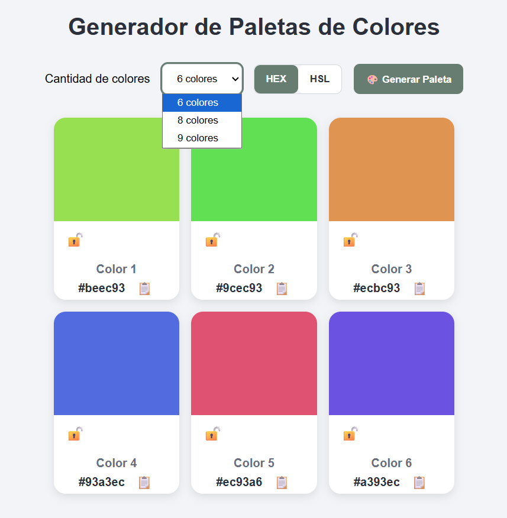
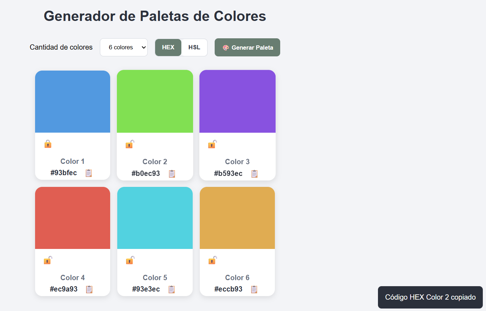
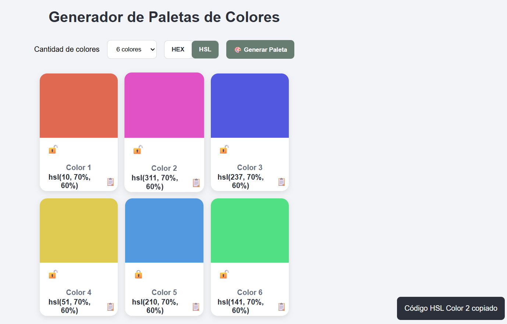
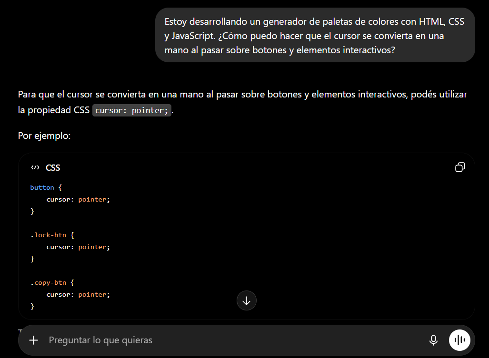
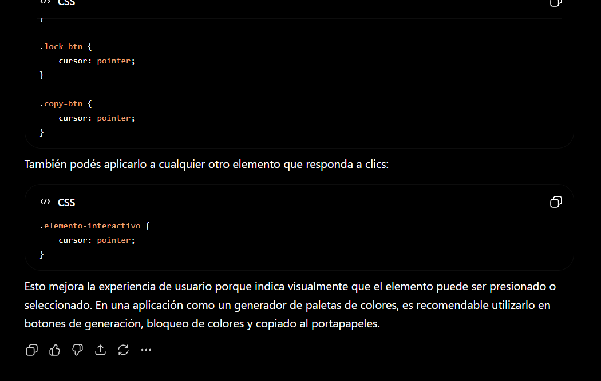
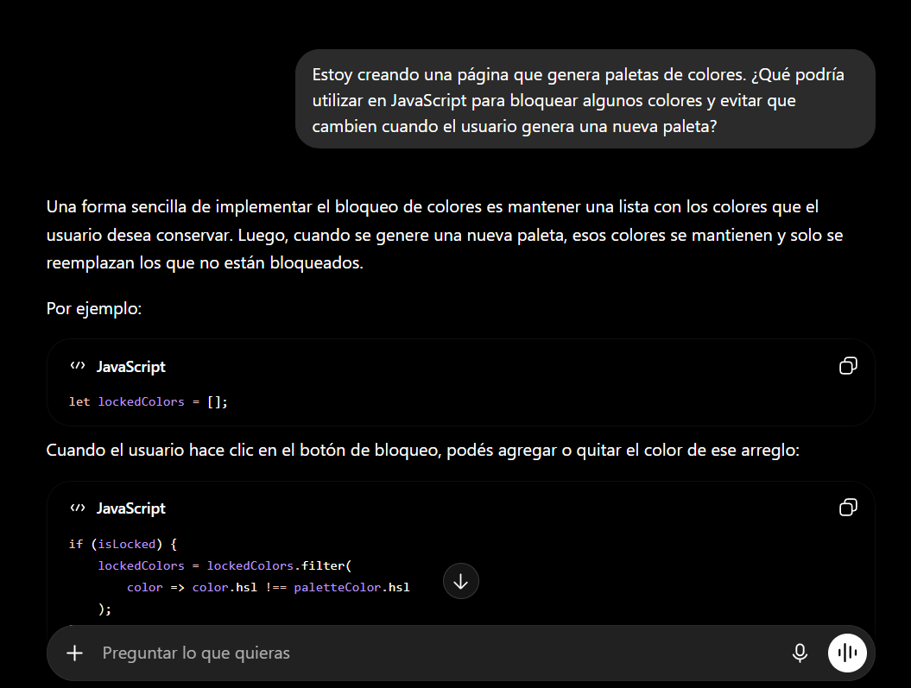
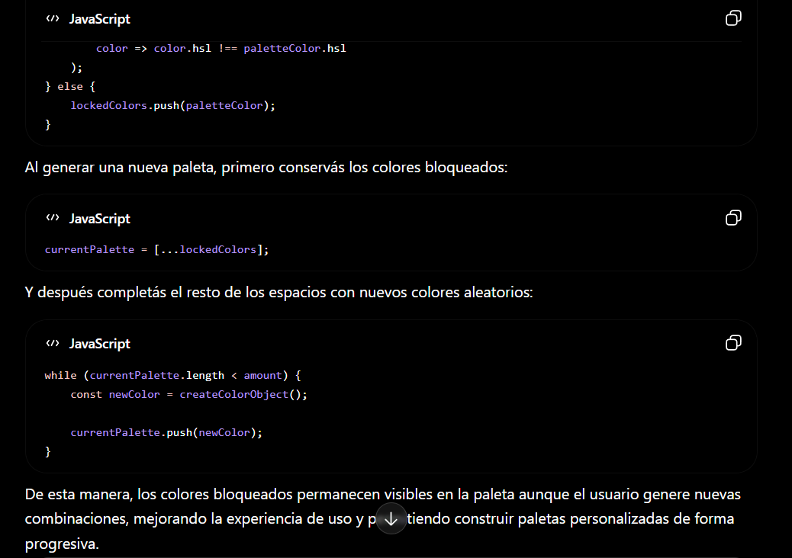

# 🎨 Generador de Paletas de Colores

## Descripción

Aplicación web desarrollada con HTML, CSS y JavaScript que permite generar paletas de colores aleatorias. El usuario puede seleccionar la cantidad de colores, visualizar los códigos en formato HEX o HSL, bloquear colores para conservarlos y copiar códigos al portapapeles.

---

## Funcionalidades

- Generación aleatoria de paletas de colores.
- Selección de 6, 8 o 9 colores.
- Visualización en formato HEX o HSL.
- Copia de códigos al portapapeles.
- Bloqueo de colores.
- Microfeedback mediante toast.
- Diseño responsive.
- Animaciones sutiles.

---

## Tecnologías utilizadas

- HTML5
- CSS3
- JavaScript
- Git
- GitHub
- GitHub Pages

---

## Cómo ejecutar el proyecto

1. Clonar o descargar el repositorio.
2. Abrir la carpeta del proyecto.
3. Ejecutar `index.html` o utilizar Live Server.

o

Acceder a la versión en linea mediante el enlace disponible:
https://naylapereira.github.io/ProyectoM1_NaylaPereira-/

---

## Capturas de la aplicación

### Pantalla principal

### Copia al portapapeles

---

## Uso de Inteligencia Artificial

Durante el desarrollo del proyecto se utilizaron herramientas de inteligencia artificial como apoyo para resolver dudas relacionadas con CSS y JavaScript.

---

### Consulta 1: Cursor en elementos interactivos

**Prompt**

> Estoy desarrollando un generador de paletas de colores con HTML, CSS y JavaScript. ¿Cómo puedo hacer que el cursor se convierta en una mano al pasar sobre botones y elementos interactivos?

**Captura de la consulta y respuesta**

**Aplicación en el proyecto**

Se utilizó la propiedad CSS `cursor: pointer` en botones y elementos interactivos para mejorar la experiencia de usuario.

---

### Consulta 2: Bloqueo de colores

**Prompt**

> Estoy creando una página que genera paletas de colores. ¿Qué podría utilizar en JavaScript para bloquear algunos colores y evitar que cambien cuando el usuario genera una nueva paleta?

**Captura de la consulta y respuesta**

**Aplicación en el proyecto**

Se implementó un sistema de bloqueo de colores utilizando un arreglo para conservar los colores seleccionados al generar nuevas paletas.

---

## Decisiones técnicas

- Se eligió HSL para generar colores porque permite mantener una saturación y luminosidad consistentes mientras cambia el tono.
- Cada color se almacena como un objeto que contiene su representación HSL y HEX.
- Se utilizó CSS Grid para organizar las tarjetas de colores de manera ordenada y adaptable.
- Se implementó JavaScript para la generación dinámica de paletas y la interacción con el usuario.

---

## Autor

**Nayla Pereira**

Proyecto Integrador - Módulo 1